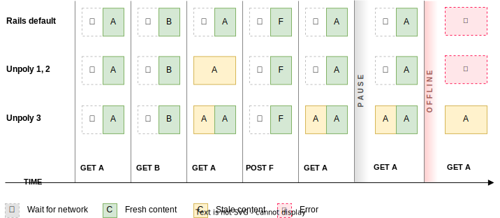
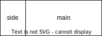
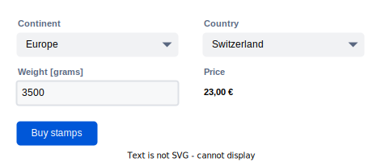
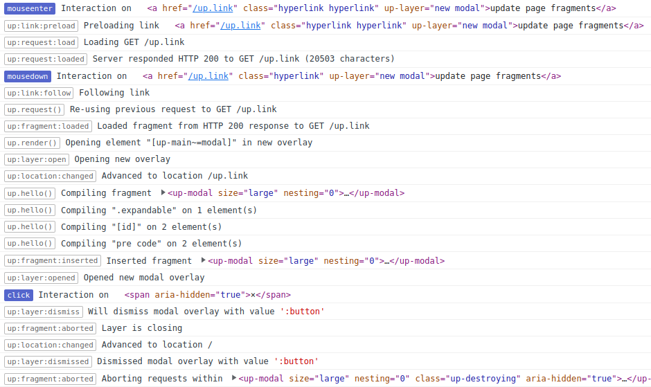

<!-- _class: no-watermark -->

<div class="title">
  
  <div class="title--author">
    Henning Koch&nbsp; <a href="https://twitter.com/triskweline">@triskweline</a>
  </div>  
</div>


---

# About Unpoly

[Unpoly](https://unpoly.com) is an unobtrusive JavaScript framework for server-side web applications.\
It enables fast and flexible frontends while keeping rendering logic on the server.

**This presentation is for experienced Unpoly users\
who want to learn about the major changes in Unpoly 3.**

Unpoly 3 is scheduled to release in late summer 2022.


----

Unpoly 3 objectives
===================

<div class="row">
<div class="col" style="flex-grow: 1.5">

### Concurrency

- User clicking faster than the server can respond
- Multiple requests targeting the same fragment
- Forms where everything depends on everything else
- Responses arrive in different order than requests
- Multiple users working on the same backend data (stale caches)
- User losing connection while requests are in flight
- Lie-Fi (spotty Wi-Fi, EDGE, tunnel)
</div>
<div class="col">

### Quality of live improvements

- Optional targets
- More control over `[up-hungry]`
- Shorter data attributes
- More render callbacks
- Strict target derivation
- Better feedback
- Log separated by interactions
- Foreign overlays
</div>


---
<!-- _class: secondary-color -->


# This will be a smooth update

- Upgrade from v2 to v3 will be *much* smoother than going from v1 to v2.
- No changes in HTML or CSS provided by Unpoly.
- Almost all are breaking changes are polyfilled by [`unpoly-migrate.js`](https://unpoly.com/changes/upgrading).
- Unpoly 3 keeps aliases for deprecated APIs going back to 2016.\
  You can upgrade from v1 to v3 (without going through v2).

See the [upgrade guide](https://unpoly.com/changes/upgrading) for details.

---
<!-- _class: topic -->

# Concurrency


---

# Cache revalidation

Unpoly has always cached `GET` responses for a few minutes.\
This allowed for instant navigation between pages we visited earlier, but had some issues:

- Users were sometimes seeing stale content.\
  Because of this many projects configured cache expiry down to a few seconds.
- Every non-GET request cleared the entire cache.\
  This caused unnecessary cache misses after submitting a form.
  
Unpoly 3 fixes all of this with *cache revalidation*.

---


The cache in Unpoly 3 now follows a *stale-while-revalidate* pattern.
After rendering stale content from the cache, Unpoly automatically reloads the fragment.

This process is called *cache revalidation*.
  
In effect Unpoly always renders twice:

- A first render pass from the cache (which may be stale)
- A second render pass from the server (which is always fresh)

This has many benefits:

- This allows a very long cache eviction time,
  allowing instant navigation for 90 minutes.
- We no longer need to clear the cache after a form submission.\
  We just mark all cache entries as stale. 
- Because we always revalidate cached content, the user always sees fresh content!


---
<!-- _class: no-watermark -->



---

### `up.network.config.cacheExpireAge`

- When cached content exceeds this age we perform cache revalidation\
 (reload a rendered fragment)
- This should only cover the time between preloading and rendering.
- Defaults to 15 seconds (down from 5 minutes in Unpoly 2)


### `up.network.config.cacheEvictAge`

- When cached content exceeds this age we delete it from the cache
- This limit exists mostly to limit memory consumption.
- Defaults to 90 minutes (lower for low-memory devices).


---

Controlling when to revalidate
------------------------------

You may configure what responses to revalidate, e.g. to exclude certain paths.

The default setting is:


```js
// A response older than up.network.config.cacheExpireAge is stale
up.fragment.config.autoRevalidate = (response) => response.stale
```

You may also disable revalidation for an individual link:

```html
<a href="/path" up-follow up-revalidate="false">
```


---

Migrating Unpoly 2 apps
-----------------------

Since caching is now without drawbacks, you may want to remove any exemptions in your app.

#### Remove custom expiry times:

```js
up.network.config.cacheExpiry = 10_0000
```

#### Remove individual links bypassing the cache

```html
<a href="/path" up-follow up-cache="false">...</a>
```

```js
up.render({ url: '/path', cache: false })
```

#### Remove global cache exemptions

```js
up.network.config.autoCache = (request) => !request.path.startsWith('/dashboard') && ...
```


---
<!-- _class: pro -->

## Revalidation happens after `up.render()` settles


```js
await up.render(..)
// Fragment is updated, but animation and revalidation may still be underway
```

```js
await up.render(..).finished
// Fragment is fully updated, transitioned and revalidated
```

---

Does revalidation cause more requests?
--------------------------------------

**No**.

With revalidation your app will make as many requests as a plain web app\
(but users still benefit from seeing cached content immediately).

With revalidation your app will make as many requests as an Unpoly 2 app with short cache expiry.\
Many of our projects have configured cache expiry to "fix" stale content.

**Optionally** your app can support *conditional requests* so reloading is effectively free for the server.


----

Conditional request support
===========================

Conditional requests is an old HTTP feature ([RFC 7232](https://datatracker.ietf.org/doc/html/rfc7232)).

It lets browser ask for content newer than a known modification time,\
or content different from a known content hash.


-----
<!-- _class: no-watermark -->

Requesting content newer than a known modification time 
-------------------------------------------------------

Browser requests a URL for the first time:

```http
GET /foo HTTP/1.1
```

Server responds with content and last modification time (e.g. `#updated_at`):


```http
HTTP/1.1 200 OK
Last-Modified: Wed, 15 Nov 2000 13:11:22 GMT
...
```

When the browser revisits the same URL is echoes the earlier modification time:

```http
GET /foo HTTP/1.1
If-Modified-Since: Wed, 15 Nov 2000 13:11:22 GMT
```

The server checks modification time and may respond **without content**:

```http
HTTP/1.1 304 Not Modified
```


-----
<!-- _class: no-watermark -->

Requesting content changed from a known content hash
----------------------------------------------------

Browser requests a URL for the first time:

```http
GET /foo HTTP/1.1
```

Server responds with content and a hash over the underlying data:


```http
HTTP/1.1 200 OK
ETag: "x234dff"
...
```

When the browser revisits the same URL is echoes the earlier hash:

```http
GET /foo HTTP/1.1
If-None-Match: "x234dff"
```

The server checks data hash and may respond **without content**:

```http
HTTP/1.1 304 Not Modified
```


----

Modification time or content hash?
----------------------------------


Servers can use both `Last-Modified` and `ETag`, but `ETag` always takes precedence.

It's easier to mix in additional data into an `ETag`, e.g. the ID of the logged in user or the currently deployed commit revision.


----
<!-- _class: no-watermark -->


Unpoly 3 supports conditional requests when reloading
-----------------------------------------------------

Unpoly remembers the `Last-Modified` and `ETag` headers a fragment was delivered with:

```html
<div class='messages' up-time='Wed, 21 Oct 2015 07:28:00 GMT' etag='"x234dff"'>
...
</div>
```

When the fragment is reloaded, Unpoly echoes these values using standard HTTP headers:

```http
GET /messages HTTP/1.1
X-Up-Target: .messages
If-Modified-Since: Wed, 21 Oct 2015 07:28:00 GMT
If-None-Match: "x234dff"
```

If no fresher data exists, the server may skip rendering and respond without content:

```http
HTTP/1.1 304 Not Modified
```

In practice you would use either `Last-Modified` or `ETag`, but never both.


----

Your app should probably support conditional requests
-----------------------------------------------------

This improves **all** cases where we access a previously visited page:

- Reduced server load (no server-side rendering required for unchanged content)
- Less data transmitted (think slow connections, mobile data plans!)
- Cheap cache revalidation
- Cheap [`[up-poll]`](https://unpoly.com/up-poll)
- Prevent unnecessary DOM swaps of identical content (client-side performance)


----
<!-- _class: rails-specific -->


Implementing conditional requests in Ruby on Rails
==================================================

**If you're not a Rails user**, skip to a slide without the Rails logo ↗.

While you can manually manage and compare `request.headers['ETag']` and `response.headers['ETag']` in your controllers, Rails ships with helpers to help deal with ETags.


----
<!-- _class: rails-specific -->

```ruby
class PostsController < AppplicationController

  # Produce different ETags for different users
  etagger { current_user&.id }

  def show
    @post = Post.find(params[:id])

    # Produces ETag from (1) class name (2) @post.id
    # (3) @post.updated_at (4) view template code (5) flashes.
    # Renders 304 Not Modified if ETag matches If-None-Match header.
    fresh_when @post
  end
  
  def index
    @posts = Post.order(created_at: :desc)

    # Produces ETag from (1) class name (2) scope conditions
    # (3) @posts.maximum(:updated_at) (4) view template code (5) flashes.
    # Renders 304 Not Modified if ETag matches If-None-Match header.
    fresh_when @posts
  end

end
```
[Full controller example](https://makandracards.com/makandra/19041-a-simpler-default-controller-implementation-2022-update)


---
<!-- _class: rails-specific -->

Default ETags in Rails
----------------------

Even without `fresh_when` Rails [produces a default ETag](https://rdoc.info/github/rack/rack/Rack/ETag) by hashing the response body.

❌ You still pay the rendering time\
✅ You won't transmit unchanged HTML.\
✅ You won't re-render unchanged content.

This default ETag has issues with random tokens (CSRF token, CSP nonce),\
causing ETags to never match. Use our [`Rack::SteadyETag`](https://github.com/makandra/rack-steady_etag) gem to address this.


----


All of this is optional!
------------------------

Unpoly's cache revalidation will work **with or without** conditional request support.

If your app does not support conditional requests, cache revalidation will cause as many requests as an Unpoly 2 app with short cache expiry.


----
<!-- _class: no-watermark -->

Concurrent updates to the same fragment
=======================================

<div class="row">
<div class="col" style="flex-basis: auto">

</div>
<div class="col" style="flex-basis: auto">

When two requests target `main`, what should happen?

The answer to that changed throughout Unpoly's history.
</div>
</div>


### Unpoly 1: Do nothing

Responses would be rendered in whatever order they arrive.

### Unpoly 2: Abort all pending requests when navigating

This mimics standard browser behavior, where clicking a link aborts earlier clicks.\
Unfortunately this also aborted background requests, or requests for unrelated regions like `side`.

### Unpoly 3: Abort requests within the targeted fragment only


---


Targeting a fragment will abort conflicting requests
-----------------------------------------------------

Clicking this link will automatically cancel requests targeting `.region` or its descendants:
    
```html
<a href="/path" up-target=".region">
```

Same when rendering programmatically:

```js
up.render({ url: '/path', target: '.region' })
```

Aborting without rendering:

```js
up.fragment.abort('.region')
```


---

Reacting to a fragment being aborted
------------------------------------

When your own components is waiting for something async (e.g. a request or a timeout),\
it may want to react when its element (or an ancestor) is aborted.\
This can prevent race conditions in your app.


---
<!-- _class: no-watermark -->

This compiler will follow a link after 5 seconds:

```js
up.compiler('a[auto-follow]', function(link) {
  let followLink = () => up.follow(link)
  let timer = setTimeout(followLink, 5000) // (1)
  return () => clearTimeout(timer)
})
```

There is a race condition in the code above:

- Timer (1) starts
- While the timer (1) is waiting, the user follows different link (2)
- While the user link (2) is loading, the timer (1) elapses and follows the original link
- The user request (2) is aborted

---

Using `up.fragment.onAborted()` we can stop the timer if the link is targeted while waiting:

```js
up.compiler('a[auto-follow]', function(link) {
  let followLink = () => up.follow(link)
  let timer = setTimeout(followLink, 5000)
  up.fragment.onAborted(link, () => clearTimeout(timer))
})
```

Note that a fragment is also aborted before it is removed from the DOM\
(through `up.destroy()` or a fragment swap). Hence we don't need an additional destructor.

---

Some other cases from Unpoly's own features:

- Polling stops when the reloading fragment is aborted
- Pending validations are aborted when the observed field is aborted


---

Exemption: Don't abort others
------------------

To not abort requests targeting the same fragments,\
render with `{ abort: false }` or `[up-abort=false]`.


Exemption: Don't abort me
--------------

To make a request that will not be aborted by another fragment update, use `{ abortable: false }` or `[up-abortable=false]`.


---


What about preloading?
----------------------

Preloading never aborts targeted fragments.

Programmatic preloading with `up.link.preload()` is not abortable by default in Unpoly 3.\

You can use this to populate the cache while the user is navigating:

```js
up.compiler('.main-nav', function(nav) {
  nav.querySelectorAll('a').forEach(up.link.preload)
})
```


---
<!-- _class: no-watermark -->


Forms where everything depends on everything
=========================================




----

## We can build this with `[up-validate]`, but.….

```html
<form method="post" action="/purchases">
  <select name="continent" up-validate="[name=country]">...</select>
  <select name="country" up-validate="[name=price]">...</select>
  <input name="weight" up-validate="[name=price]"> kg
  <output name="price">23 €</output>
  <button>Buy stamps</button>
</form>
```

This form has **race conditions** in Upoly 2:

- User changes continent
- Request 1 targeting `[name=country]` starts
- User changes weight
- Request 2 targeting `[name=price]` starts
- User changes continent again
- Request 3 targeting `[name=country]` starts
- Three responses arrive and render in random order


---

Disabling form elements while loading
--------------------------------------

Forms with `[up-disable]` attribute disable all fields and buttons while submitting or validating.\
This prevents user input while the form is loading:


```html
<form up-submit up-disable>
  <input type="text" name="email"> <!-- will be disabled during submission -->
  <button>Submit</button>          <!-- will be disabled during submission -->
</form>
```

You can also only disable the submit button:

```html
<form up-submit up-disable="button">
```

Or any given CSS selector:

```html
<form up-submit up-disable="input[name=email]">
```

---


----

<h2>
  Don't want to disable?
</h2>

Sometimes we don't want to disable because of user speed or optics (gray fields).\
Unpoly 3 has an <b>second</b> solution for forms where many fields update other fields.


----
<!-- _class: no-watermark -->


```html
<form method="post" action="/purchases">
  <select name="continent" up-validate="[name=country]">...</select>
  <select name="country" up-validate="[name=price]">...</select>
  <input name="weight" up-validate="[name=price]"> kg
  <output name="price">23 €</output>
  <button>Buy stamps</button>
</form>
```

<div class="row" style="font-size: 0.9em">
<div class="col">

### Unpoly 2: Race conditions

- User changes continent
- Request 1 for `[name=country]` starts
- User changes weight
- Request 2 for `[name=price]` starts
- User changes continent again
- Request 3 for `[name=country]` starts
- Responses arrive and render in random order
</div>
<div class="col" style="flex-grow: 1.2">

### Unpoly 3: Eventual consistency

- User changes continent
- Request 1 for `[name=country]` starts
- User changes weight
- User changes continent again
- Response 1 received and rendered
- Request 2 for `[name=price], [name=country]` starts
- Response 2 received and rendered
</div>
</div>


----

Eventual consistency guarantee for <code>[up-validate]</code>
-------

- Multiple updates from `[up-validate]` or `up.validate()`\
  are batched into a single render pass with multiple targets.
- Duplicate or nested targets are consolidated.
- Unpoly guarantees only one concurrent validation request per form.\
  Additional validations are queued until the current validation request has loaded.
- The form will eventually show a consistent state,\
  regardless how fast the user clicks or how slow the network is.


---


Watching fields for changes
===========================

`[up-observe]` is now `[up-watch]`\
`up.observe()` is now `up.watch()`

Watching fields gets a lot of useful options.

---

Field-specific watch options
----------------------------

Every form field can configure individual options for watching and validation.\
Options can be set for a field, the entire form or any container element.

#### `[up-watch-event]`

Which event triggers watch callbacks or validation (e.g. `input` or `change`).

#### `[up-watch-delay]`

How many milliseconds to wait after a change before a watch callback or validation is run.

#### `[up-watch-disable]`

Whether to disable this form (or any fragment) while an async watch callback or validation is running.

#### `[up-watch-feedback]`

Whether to set `.up-active` and `.up-loading` classes while an async watch callback or validation is running.

---

Example
-------

```html
<form method="post" action="/purchases">
  <select name="continent" up-validate="[name=country]" up-watch-disable="[name=country]">
    ...
  </select>
  <select name="country" up-validate="[name=price]">...</select>
  <input name="weight" up-validate="[name=price]" up-watch-event="input"> kg
  <output name="price">23 €</output>
  <button>Buy stamps</button>
</form>
```

The `[up-watch-disable]` attribute disables the country select while new countries are loading after a continent changes.

The `[up-watch-event]` attribute updates the price while the user is typing in the weight field (instead of waiting until the field is blurred).


---

Handling disconnects
====================

Unpoly 3 lets you handle connection loss with an `{ onOffline }` or `[up-on-offline]` callback:

```html
<a href="..." up-on-offline="if (confirm('Retry'?) event.retry()">Post bid</a>
```

Or globally:

```js
up.on('up:fragment:offline', function(event) {
  if (confirm('Retry'?)) event.retry()
})
```

Or substitute content:

```js
up.on('up:fragment:offline', function(event) {
  up.render(event.renderOptions.target, { content: "You are offline." })
})
```


----

Handling ["Lie-Fi"](https://www.urbandictionary.com/define.php?term=lie-fi)
---------------------------------------------------------------------------

Often our device reports a connection, but we're effectively offline:

- Smartphone in EDGE cell
- Car drives into tunnel
- Overcrowded Wi-fi with massive packet loss

Unpoly 3 handles Wi-Fi with timeouts:

- All requests have a default timeout of 90 seconds (`up.network.config.timeout`)
- Timeouts will now trigger `onOffline()` and use your offline handling
- Customize timeouts per-request with `{ timeout }`, `[up-timeout]` options


----

Expired pages remain accessible while offline
---------------------------------------------

- Cached content will remain navigatable for 90 minutes
- Revalidation will fail, but not change the page and trigger `onOffline()`
- Clicking uncached content will not change the page and trigger `onOffline()`


---


Limitations
-----------

While Unpoly 3 lets you handle disconnects, it's not full "offline" support:

- To fill up the cache the device must be online for the first part of the session (warm start)
- The cache is still in-memory and dies with the browser tab

For a full offline experience (cold start) we recommend a [service worker](https://web.dev/offline-fallback-page/)\
or a canned solution like [UpUp](https://www.talater.com/upup/) (no relation to Unpoly).


---
<!-- _class: topic -->

# Quality of life


----


Optional targets
================

If you suffix a target selector with `:maybe` it will only be updated if there is a match in both the current page and server response (like `[up-hungry]`).

## Example

The following would require fragments matching `.content` and `.navigation`.\
If `.flashes` is missing in either current page or server response, no error
is thrown.

```html
<a href="/post" up-target=".content, .flashes:maybe, .navigation">
```

----


More control over `[up-hungry]`
===============================

Elements with an `[up-hungry]` attribute are updated whenever the server sends a matching element, even if the element isn't targeted.

Unpoly 3 lets you control which layer and which target to piggy-back on.


---

Controlling which layer to piggy-back on
----------------------------------------

By default Unpoly only considers `[up-hungry]` fragments in the updating layer.

With `[up-if-layer=any]` a hungry fragment will be considered for updates in *any* layer.


### Example

A use case is notification elements in the application layout:

```html
<div class="flashes" up-hungry up-if-layer="any">...</div>
<div class="unread-messages" up-hungry up-if-layer="any">...</div>
```


---

Controlling which targets to piggy-back on
------------------------------------------

By default Unpoly considers `[up-hungry]` fragments for any update in its layer.

With `[up-if-target]` you can restrict which updates a hungry fragment will piggy-back on.


### Example

A use case is a canonical `<link>` element that should only update when we update a [main element](https://unpoly.com/main),
but not when we update smaller fragments:

```html
<link rel="canonical" href="..." up-hungry up-if-target=":main" />
```

----


Shorter data attributes
=======================


Unpoly always had [`[up-data]`](https://unpoly.com/up-data) to attach structured data to an element.

This is verbose when we're attaching simple key/value pairs:

```html
<div class="user" up-data="<%= { name: @user.name }.to_json %>">
```

It would feel more natural to use HTML5 data attributes instead:

```html
<div class="user" data-name="<%= @user.name %>">
```


---

In Unpoly 3 simple data key/values can be attached with both `[up-data]`\
and HTML5 data attributes.

These three elements produce the same compiler data:

```html
<div up-data='{ "foo": "one", "bar": "two" }'></div>
<div data-foo='one' data-bar='two'></div>
<div up-data='{ "foo": "one" }' data-bar='bar'></div>
```

```js
up.compiler('div', function(element, data) {
  console.log(data.foo) // is always "one"
  console.log(data.bar) // is always "two"
})
```

Note that HTML5 data attributes are always flat objects with string values.\
If you need to serialize something like an array of numbers, use `[up-data]`.


---
<!-- _class: rails-specific -->

<b>Ruby on Rails users</b> can now use the `{ data }` option of any element helper\
to pass data to compilers:

```ruby
content_tag(:div, '...', data: { foo: 'one', bar: 'two' })
```


---

Highlighting the targeted fragment
==================================

Targeted fragments get an `.up-loading` class.\
This lets you highlight the part of the screen that's loading.

Targeted fragments also get an [`[aria-busy]`](https://developer.mozilla.org/en-US/docs/Web/Accessibility/ARIA/Attributes/aria-busy) attribute for accessibility.

---

Example
-------

A link targeting a fragment:

```html
<a href="/path" up-target=".target">
<div class="target">old text</div>
```

While the request is loading:

```html
<a href="/path" up-target=".target" class="up-active">
<div class="target" class="up-loading" aria-busy>old text</div>
```

Once the fragment is updated all classes and attributes are removed:

```html
<a href="/path" up-target=".target">
<div class="target">new text</div>
```

---

Log separated by interactions
=============================

The log has a lot of debug information.\
It's often hard to find where the relevant output begins and ends.

The new log shows which user interaction triggered an event chain.

---

<!-- _class: no-watermark no-padding -->



---

Playing nice with foreign overlays
=================================

Unpoly 2 sometimes clashes with overlays from other libraries ("foreign overlay")\
like Bootstrap or TinyMCE:

- Clicking a foreign overlay closes an Unpoly overlay
- Unpoly steals focus from a foreign overlay

This happens when foreign overlays look "on top" visually (`z-index: 99999999999`), but their elements attach to the `<body>`. For Unpoly this looks like content on the root layer. 

This could often be fixed by attaching the foreign overlay to the correct Unpoly layer (pseudo-code):

```js
OtherOverlay.open({ content: 'foo', onOpen(overlay) { up.layer.element.attach(overlay) }})
```

However, the solution is custom to every library.

---

Making Unpoly aware of foreign overlays
----------------------------------------

You can push a selector into `up.layer.config.foreignOverlaySelectors` and Unpoly will no longer have layer-related opinions over that region. You no longer need to re-attach the foreign overlay element.

Example from `unpoly-bootstrap5.js`:

```js
up.layer.config.foreignOverlaySelectors.push(
  '.modal',
  '.popover',
  '.dropdown-menu'
)
```


---

More control over the progress bar
==================================

Unpoly 2.1 has introduced a progress bar that shows while a request takes too long to load.

This may be unwanted for requests are loading in the background, or have longer load
times in the best of cases (e.g. a large report).

Unpoly 3 gives you more control over if and when the progress bar shows.


---


Background requests
--------------------

Pass `{ background: true }` or `[up-background]` when rendering or making a request

Background requests never trigger the progress bar.\
Background requests are also deprioritized.

### Uses cases from Unpoly

- Polling requests are background requests automatically
- Preload requests are background requests automatically


---
<!-- _class: pro -->

Custom target response times
----------------------------

You can also set `[up-bad-response-time]` on an individual link:

```html
<a href="/huge-report" up-bad-response-time="10_000">Open report</a>
```


----

Extensive render callbacks
==========================

You may now pass callback functions to intervene at many points
in the rendering lifecycle.

```js
up.render({
  url: '/path',
  onLoaded(event)        { /* Content was loaded from cache or server */ },
  focus(fragment, opts)  { /* Set focus */ },
  scroll(fragment, opts) { /* Set scroll positions */ },
  onRendered(result)     { /* Fragment was updated */ },
  onFailRendered(result) { /* Fragment was updated from failed response */ },
  onRevalidated(result)  { /* Stale content was re-rendered */ },
  onFinished(result)     { /* All finished, including animation and revalidation */ }
  onOffline(event)       { /* Disconnection or timeout */ },
  onError(error)         { /* Any error */ }
})
```

---

Strict target derivation
========================


Unpoly often needs to *derive* a target selector from an element.\
Some features that do this are `[up-poll]`, `up.reload()`, `[up-hungry]`.

```js
up.reload(element) // Produces a target selector from the given element
```

To build the selector, Unpoly 2 uses the following element properties in decreasing
order of priority:

- The element's `[up-id]` attribute
- The element's `[id]` attribute
- The element's `[name]` attribute
- The element's `[class]` names, ignoring `up.fragment.config.badTargetClasses`.
- The element's tag name


---

## When target derivation goes wrong

The target derivation in Unpoly 2 sometimes produces a weak selector that won't uniquely identify the element:

```html
<link rel="stylesheet" href="...">
<link rel="canonical" href="..." up-hungry>
```

Here the `[up-hungry]` element would targets `link`, matching the stylesheet instead.


---

New target derivation patterns
------------------------------

Unpoly 3 lets you configure patterns to use for target derivation.\
The following patterns are configured by default:

```js
up.fragment.config.targetDerivers = [
  '[up-id]',      // [up-id="foo"]
  '[id]',         // #foo
  'html',         // html
  'head',         // head
  'body',         // body
  'main',         // main
  '[up-main]',    // [up-main="root"]
  'link[rel]',    // link[rel="canonical"]
  '*[name]',      // input[name="email"]
  'form[action]', // form[action="/users"]
  'a[href]',      // a[href="/users/"]
  '[class]',      // .foo (filtered by up.fragment.config.badTargetClasses)
]
```

Note that tag names are now only used for unique elements (like `<body>` or `<main>`).

You can also push a function if your deriver can't be expressed in a pattern string.


---

Derived target verification
---------------------------

- Unpoly 3 will verify if a derived targets will actually match the element.
- If another element is matched, the next pattern is tried.
- If no pattern produces a matching target, an error is thrown.

This *may* throw errors in existing apps with ambiguous selectors.\
This means your app is updating the wrong fragments!\
You should fix these bugs by setting an `[id]`, `[up-id]` or `[class]` attribute.


---

Detect failure when server sends incorrect HTTP status
======================================================

Unpoly can update different targets for [failed responses](https://unpoly.com/server-errors).\
E.g. a successful form submission should the main element when successful.\
When there are validation errors we want to re-render the form instead.

For this to work Unpoly requires servers to signal failure with an HTTP error code.\
E.g. an invalid form should render with HTTP 400 (Bad Request).

Unfortunately misconfigured server endpoints will send HTTP 200 (OK) for failed responses.\
This is not always easy to fix, e.g. when screens are rendered by libraries outside your control.

---

Forcing failure
---------------

Listeners to `up:fragment:loaded` can now force a failure, even for responses that are `200 OK`.

```js
up.on('up:fragment:loaded', (event) => {
  console.log(response.status) // => 200

  if (event.response.headers['X-Authentication-Error']) {
    // Force Unpoly to use render options for failure
    // despite the `200 OK` status code.
    event.renderOptions.fail = true
  }
})
```

You may also globally customize what Unpoly considers an error:

```js
up.network.config.fail = (response) => 
  (response.status < 200 || response.status > 299) && response.status !== 304
```


---

Focus restoration
=================

Focus is saved automatically and restored when using the back and forward button.

Saved state includes:

- Which element is focused.
- The cursor position within a focused input element.
- The selection range within a focused input element.
- The scroll position within a focused input element.

---

Explicit focus restoration
------------------------

- `<a href="/path" up-follow up-focus="restore">`
- `up.render({ focus: 'restore' })`
- `up.viewport.restoreFocus()`

Note that Unpoly already had `{ focus: 'keep' }` to preserve focus within
an updating fragment.

---

IE11 removal
============

Unpoly 3 will no longer boot on IE11 or [legacy Edge (EdgeHTML)](https://en.wikipedia.org/wiki/EdgeHTML).\
If you need to support Internet Explorer 11, use Unpoly 2.

This allowed us to delete a lot of internal code.


---

Functions with a native replacement have been moved to `unpoly-migrate.js`:

| Deprecated function | Native replacement |
|---------------------|--------------------|
| `up.util.assign()` | `Object.assign()` |
| `up.util.values()` | `Object.values()` |
| `up.element.remove()` | `Element#remove()` |
| `up.element.matches()` | `Element#matches()` |
| `up.element.closest()` | `Element#closest()` |
| `up.element.replace()` | `Element#replaceWith()` |
| `up.element.all()` | `document.querySelectorAll()` |
| `up.element.toggleClass()` | `Element#classList.toggle()` |


---


Many other features and fixes
=============================

See [full CHANGELOG](https://github.com/unpoly/unpoly/blob/master/CHANGELOG.md).


---
<!-- _class: topic -->

# Closing


---

Breaking changes
================

Probably none with [`unpoly-migrate.js`](https://unpoly.com/changes/upgrading).

You should test if you're seeing any errors with:

- Strict target derivation
- Cache revalidation

----

### Strict target derivation

Disable with:

```js
up.fragment.config.verifyDerivedTarget = false
up.fragment.config.targetDerivers.push('*')
```

---

### Cache Revalidation

Disable with:

```js
up.fragment.config.autoRevalidate = false
up.network.config.cacheEvictAge = up.network.config.cacheExpireAge = 15 * 60 * 1000
```


----


Unpoly 3 objectives
===================

<div class="row">
<div class="col" style="flex-grow: 1.5">

### Concurrency

- User clicking faster than the server can respond
- Multiple requests targeting the same fragment
- Forms where everything depends on everything else
- Responses arrive in different order than requests
- Multiple users working on the same backend data (stale caches)
- User losing connection while requests are in flight
- Lie-Fi (spotty Wi-Fi, EDGE, tunnel)
</div>
<div class="col">

### Quality of live improvements

- Optional targets
- More control over `[up-hungry]`
- Shorter data attributes
- More render callbacks
- Strict target derivation
- Better feedback
- Log separated by interactions
- Foreign overlays
</div>


---

Availability
============

Unpoly 3 is scheduled to release in late summer 2022.


---

<!-- _class: no-watermark -->

<div class="title">
  
  <div class="title--author">
    Henning Koch&nbsp; <a href="https://twitter.com/triskweline">@triskweline</a>
  </div>  
</div>
