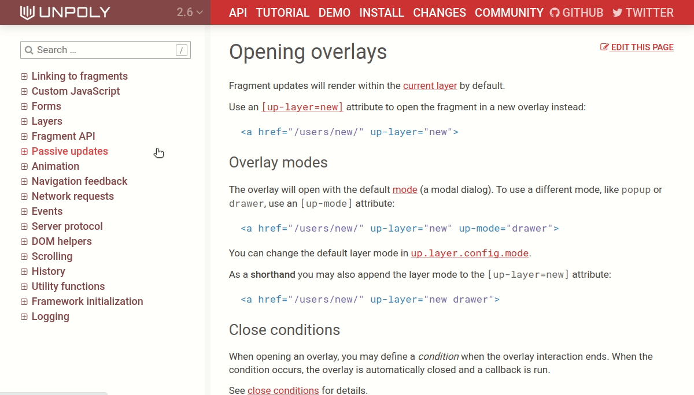

Disabling outside a form submission
-----------------------------------

Fields marked with `[up-validate]` and `[up-watch]` (former `[up-disable]`) can also disable other fields while loading:

```html
<select up-validate=".employees" up-watch-disable=".employees">
```

Or just use `{ disable }` and `[up-disable]` options for any render operation:

```js
up.reload('.city-options', { disable: '.country-select' })
```


----

Modification time or content hash?
----------------------------------


Servers can use both `Last-Modified` and `ETag`, but `ETag` always takes precedence.

It's easier to mix in additional data into an `ETag`, e.g. the ID of the logged in user or the currently deployed commit revision.


---

Some other cases from Unpoly's own features:

- Polling stops when the reloading fragment is aborted
- Pending validations are aborted when the observed field is aborted


----

## Strict target derivation

Disable with:

```js
up.fragment.config.verifyDerivedTarget = false
up.fragment.config.targetDerivers.push('*')
```

---

## Cache Revalidation

Disable with:

```js
up.fragment.config.autoRevalidate = false
up.network.config.cacheEvictAge = up.network.config.cacheExpireAge = 15 * 60 * 1000
```


---

<!-- _class: no-watermark no-padding -->




---

## Revalidation happens after `up.render()` settles


```js
await up.render(..)
// Fragment is updated, but animation and revalidation may still be underway
```

```js
await up.render(..).finished
// Fragment is fully updated, transitioned and revalidated
```


---

Custom target response times
----------------------------

You can also set `[up-bad-response-time]` on an individual link:

```html
<a href="/huge-report" up-bad-response-time="10_000">Open report</a>
```


---

Reacting to a fragment being aborted
------------------------------------

When your own components is waiting for something async (e.g. a request or a timeout),\
it may want to react when its element (or an ancestor) is aborted.

<b class="positive">This can prevent race conditions in your app.</b>


---
<!-- _class: no-watermark -->

This compiler will follow a link after 5 seconds:

```js
up.compiler('a[auto-follow]', function(link) {
  let followLink = () => up.follow(link)
  let timer = setTimeout(followLink, 5000) // (1)
  return () => clearTimeout(timer)
})
```

There is a <b class="negative">race condition</b> in the code above:

- Timer (1) starts
- While the timer (1) is waiting, the user follows different link (2)
- While the user link (2) is loading, the timer (1) elapses and follows the original link
- The user request (2) is aborted

---

Using `up.fragment.onAborted()` we can stop the timer if the link is targeted while waiting:

```js
up.compiler('a[auto-follow]', function(link) {
  let followLink = () => up.follow(link)
  let timer = setTimeout(followLink, 5000)
  up.fragment.onAborted(link, () => clearTimeout(timer))
})
```

<b class="positive">No more race conditions.</b>

Note that a fragment is also aborted before it is removed from the DOM\
(through `up.destroy()` or a fragment swap). Hence we don't need an additional destructor.


---


Opting out of aborting
----------------------

When rendering you can opt-out of the abort mechanism.

### Don't abort others

To not abort requests targeting the same fragments,\
render with `{ abort: false }` or `[up-abort=false]`.

### Don't abort me

To make a request that will not be aborted by another fragment update,\
use `{ abortable: false }` or `[up-abortable=false]`.


---


Focus restoration
=================

Focus is saved automatically and restored when using the back and forward button.

Saved state includes:

- Which element is focused.
- The cursor position within a focused input element.
- The selection range within a focused input element.
- The scroll position within a focused input element.

---


Explicit focus restoration
------------------------

- `<a href="/path" up-follow up-focus="restore">`
- `up.render({ focus: 'restore' })`
- `up.viewport.restoreFocus()`

Note that Unpoly already had `{ focus: 'keep' }` to preserve focus within
an updating fragment.


---

Detect failure when server sends incorrect HTTP status
======================================================

Unpoly can update different targets for [failed responses](https://unpoly.com/server-errors).\
E.g. a successful form submission should the main element when successful.\
When there are validation errors we want to re-render the form instead.

For this to work Unpoly requires servers to signal failure with an HTTP error code.\
E.g. an invalid form should render with HTTP 400 (Bad Request).

Unfortunately misconfigured server endpoints will send HTTP 200 (OK) for failed responses.\
This is not always easy to fix, e.g. when screens are rendered by libraries outside your control.

---

Forcing failure
---------------

Listeners to `up:fragment:loaded` can now force a failure, even for responses that are `200 OK`.

```js
up.on('up:fragment:loaded', (event) => {
  console.log(response.status) // => 200

  if (event.response.headers['X-Authentication-Error']) {
    // Force Unpoly to use render options for failure
    // despite the `200 OK` status code.
    event.renderOptions.fail = true
  }
})
```

You may also globally customize what Unpoly considers an error:

```js
up.network.config.fail = (response) => 
  (response.status < 200 || response.status > 299) && response.status !== 304
```
