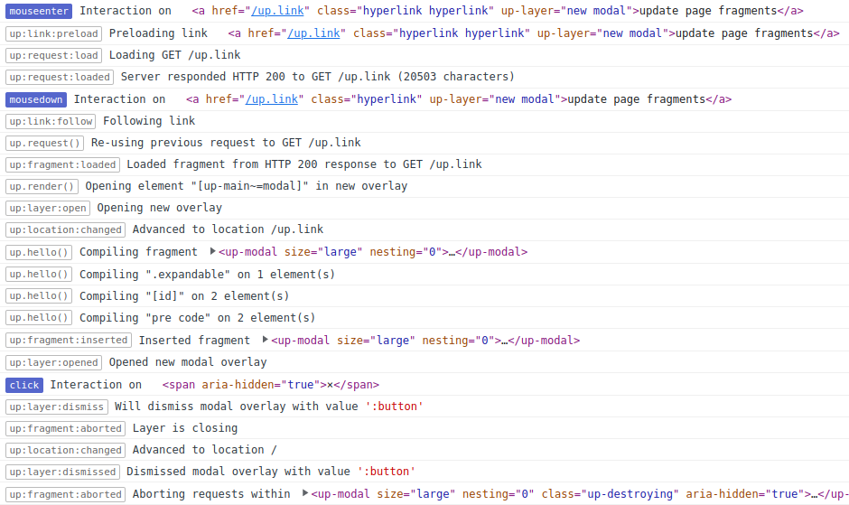

### Times


| DE    | NYC   | SF    |
|-------|-------|-------|
| 17:00 | 11:00 | 08:00 |
| 20:00 | 14:00 | 11:00 |

https://www.timeanddate.com/worldclock/meetingtime.html?iso=20230421&p1=970&p2=179&p3=224

### Days

Mondays through Fridays\
https://recurpost.com/blog/best-time-to-tweet/

### Duration

23 Posts, 10 Posts a week, ~2 weeks


----
<!-- _class: tweet -->

To celebrate the release of Unpoly 3, we're running a series of posts highlighting key changes.
Follow @unpolyjs to tag along!

<time>Fri, 21.04., 16:45</time>

---

<h1 class="topic">Unpoly 3 <span class="color-text">overview</span></h1>

<div class="row">
<div class="col" style="flex-grow: 1.5">

### Fixing all the concurrency issues

- User clicking faster than the server can respond
- Multiple requests targeting the same fragment
- Responses arrive in different order than requests
- Forms where everything depends on everything else
- Multiple users working on the same backend data (stale caches)
- User losing connection while requests are in flight
- Lie-Fi (spotty Wi-Fi, EDGE, tunnel)
</div>
<div class="col">

### Quality of life improvements

- Optional targets
- Idempotent `up.hello()`
- More control over `[up-hungry]`
- HTML5 data attributes
- Extensive render callbacks
- Strict target derivation
- Log separated by user interaction
- Foreign overlays
</div>


----
<!-- _class: tweet -->

Unpoly 3 uses a new caching technique that allows for long cache times while ensuring that users always see the latest content.

<time>Fri, 21.04., 17:00</time>

----


# Cache revalidation

Unpoly has always cached `GET` responses for a few minutes.\
This allowed for instant navigation between pages we visited earlier, but had some issues:

- Users were sometimes seeing stale content.\
  Because of this many projects configured cache expiry down to a few seconds.
- Every non-GET request cleared the entire cache.\
  This caused unnecessary cache misses after submitting a form.
  
Unpoly 3 fixes all of this with *cache revalidation*.

---

## Stale cache hits are revalidated automatically

After rendering stale content from the cache, Unpoly 3 automatically reloads the fragment.

This process is called *cache revalidation*.

Unpoly renders twice:

- A first render pass from the cache (which may be stale)
- A second render pass from the server (which is always fresh)

This has many benefits:

- We can have long cache eviction times, allowing instant navigation for 90 minutes.
- We no longer need to clear the cache after a form submission.\
  We just mark all cache entries as stale.
- Because we always revalidate cached content, the user always sees fresh content


---
<!-- _class: no-watermark small-padding -->


---

Does revalidation cause more requests?
--------------------------------------

With revalidation your app will make as many requests as a plain web app\
**or** as an Unpoly 2 app with short cache expiry.

Remember that many of our projects have configured cache expiry to "fix" stale content.

**Optionally** your app can support *conditional requests* so reloading is effectively free for the server.

----
<!-- _class: tweet -->

Unpoly 3 supports conditional requests. This lets Unpoly request content that is newer than a known modification time, or different from a known content hash. If no fresher data exists, the server may skip rendering and send an empty response.

<time>Fri, 21.04., 20:00</time>


----
<!-- _class: no-watermark -->


# Unpoly 3 supports conditional requests when reloading

Unpoly remembers the `Last-Modified` and `ETag` headers a fragment was delivered with:


```html
<div class='messages' up-time='Wed, 21 Oct 2015 07:28:00 GMT' etag='"x234dff"'>
...
</div>
```

When the fragment is reloaded, Unpoly echoes these values using standard HTTP headers:

```http
GET /messages HTTP/1.1
X-Up-Target: .messages
If-Modified-Since: Wed, 21 Oct 2015 07:28:00 GMT
If-None-Match: "x234dff"
```

If no fresher data exists, the server may skip rendering and respond without content:

```http
HTTP/1.1 304 Not Modified
```


----

Benefits of implementing conditional requests
--------------------------------------------------------

Conditional requests can improve cases where the user re-visit a page, in particular:

- Cache revalidation
- Polling with [`[up-poll]`](https://unpoly.com/up-poll)
- 

By sending `304 Not Modified` for unchanged content you get:

- Reduced server load (no server-side rendering required)
- Fewer data transmitted (think slow connections, mobile data plans)
- Prevent unnecessary DOM swaps of near-identical content

<div class="admonition">

**Note:** Without conditional request support Unpoly will still
discard identical responses when revalidating. You may define additional
rules in [`up.fragment.config.skipResponse`](https://unpoly.com/up.fragment.config#config.skipResponse)
</div>


---

## <span class="negative">Challenges</span> of implementing conditional requests

- Reloading the page during development may not always pick up changes
- Pages that display many records must either\
  (1) build ETags from multiple records or\
  (2) propagate update timestamps through associations

----
<!-- _class: tweet -->

When the user clicks faster than the server can respond, you may run into race conditions. Unpoly 3 ships with a new strategy to deal with concurrent requests targeting the same fragment.

<time>Mon, 24.04., 17:00</time>


----

<!-- _class: no-watermark -->

Concurrent updates to the same fragment
=======================================

<div class="row">
<div class="col" style="flex-basis: auto">

</div>
<div class="col" style="flex-basis: auto">

When two requests target `main`, what should happen?

The answer to that changed throughout Unpoly's history.
</div>
</div>


### Unpoly 1: Do nothing

Responses would be rendered in whatever order they arrive.

### Unpoly 2: Abort all pending requests when navigating

This mimics standard browser behavior, where clicking a link aborts earlier clicks.\
Unfortunately this also aborted background requests, or requests for unrelated regions like `side`.

### Unpoly 3: Abort requests within the targeted fragment only


---


Targeting a fragment will abort conflicting requests
-----------------------------------------------------

Clicking this link will automatically cancel requests targeting `.region` or its descendants:
    
```html
<a href="/path" up-target=".region">
```

Same when rendering programmatically:

```js
up.render({ url: '/path', target: '.region' })
```

Aborting without rendering:

```js
up.fragment.abort('.region')
```

---


What about preloading?
----------------------

Preloading never aborts targeted fragments.

Imperative preloading with `up.link.preload()` is no longer abortable by default in Unpoly 3.

You can use this to populate the cache while the user is navigating:

```js
up.compiler('.main-nav', function(nav) {
  nav.querySelectorAll('a[href]').forEach(up.link.preload)
})
```


---
<!-- _class: tweet -->

Unpoly requires failed form submissions to respond with an HTTP error code. Unfortunately some apps respond with 200 OK for everything.

Unpoly 3 has a solution that doesn't require changes on the backend.

<time>Mon, 24.04., 20:00</time>


---

Detect failure when server sends incorrect HTTP status
======================================================

Unpoly can update different targets for [failed responses](https://unpoly.com/server-errors).\
E.g. a successful form submission should the main element when successful.\
When there are validation errors we want to re-render the form instead.

For this to work Unpoly requires servers to signal failure with an HTTP error code.\
E.g. an invalid form should render with HTTP 422 (Unprocessable Entity).

Unfortunately misconfigured server endpoints will send HTTP 200 (OK) for failed responses.\
This is not always easy to fix, e.g. when screens are rendered by libraries outside your control.

---

Forcing failure
---------------

Listeners to `up:fragment:loaded` can now force a failure, even for responses that are `200 OK`.

```js
up.on('up:fragment:loaded', (event) => {
  console.log(response.status) // => 200

  if (event.response.headers['X-Authentication-Error']) {
    // Force Unpoly to use render options for failure
    // despite the `200 OK` status code.
    event.renderOptions.fail = true
  }
})
```

You may also globally customize what Unpoly considers an error:

```js
up.network.config.fail = (response) => 
  (response.status < 200 || response.status > 299) && response.status !== 304
```


---
<!-- _class: tweet -->

A common challenge in development are forms here fields have many dependencies on other fields. Unpoly 3 reworks the [up-validate] attribute to ensure complex forms will eventually show a consistent state, regardless how fast the user clicks or how slow the network is.

<time>Tue, 25.04., 17:00</time>


---
<!-- _class: no-watermark -->


Forms where everything depends on everything
=========================================

In this form changing the *Content* requires reloading the *Country* options.\
Changing any field requires recalulating the *Price*.


----
<!-- _class: no-watermark -->

## We can build this with `[up-validate]`


```html
<form method="post" action="/purchases">
  <select name="continent" up-validate="[name=country]">...</select>
  <select name="country" up-validate="[name=price]">...</select>
  <input name="weight" up-validate="[name=price]"> kg
  <output name="price">23 €</output>
  <button>Buy stamps</button>
</form>
```

<div class="row" style="font-size: 0.9em">
<div class="col">

### Unpoly 2: <span class="negative">Race conditions</span>

- User changes continent
- Request 1 for `[name=country]` starts
- User changes weight
- Request 2 for `[name=price]` starts
- User changes continent again
- Request 3 for `[name=country]` starts
- Responses arrive and <span class="negative">render in random order</span>
</div>
<div class="col" style="flex-grow: 1.2">

### Unpoly 3: <span class="positive">Eventual consistency</span>

- User changes continent
- Request 1 for `[name=country]` starts
- User changes weight
- User changes continent again
- Response 1 received and rendered
- Request 2 for `[name=price], [name=country]` starts
- Response 2 received and rendered
</div>
</div>


----

New eventual consistency guarantee for <code>[up-validate]</code>
-------

- Multiple updates from `[up-validate]` or `up.validate()`\
  are batched into a single render pass with multiple targets.
- Duplicate or nested targets are consolidated.
- Unpoly guarantees only one concurrent validation request per form.\
  Additional validations are queued until the current validation request has loaded.
- The form will eventually show a consistent state,\
  regardless how fast the user clicks or how slow the network is.


---
<!-- _class: tweet -->

Unpoly 3 also introduces the [up-disable] attribute. This prevents unwanted user input while your form is processing changes.

<time>Tue, 25.04., 20:00</time>


---

# Preventing user input while processing changes

Forms with `[up-disable]` attribute disable all fields and buttons while submitting or validating.\
This prevents user input while the form is loading:


```html
<form up-submit up-disable>
  <input type="text" name="email"> <!-- will be disabled during submission -->
  <button>Submit</button>          <!-- will be disabled during submission -->
</form>
```

You can also only disable the submit button:

```html
<form up-submit up-disable="button">
```

Or any given CSS selector:

```html
<form up-submit up-disable="input[name=email]">
```

---

### Form before user input

All fields are enabled.


---

### User selects different country

All fields disable to prevent concurrent input.


---

### Validation has completed

All fields are re-enabled.


---
<!-- _class: tweet -->

In Unpoly 3 every form field can configure options that affect both validation ([up-validate]) and watchers (up.watch()).

For instance, we can tell a field to validate while the user is typing.

<time>Wed, 26.04., 17:00</time>


---


# Field-specific watch options

```html
<form method="post" action="/purchases">
  <select name="continent" up-validate="[name=country]" up-watch-disable="[name=country]">
    ...
  </select>
  <select name="country" up-validate="[name=price]">...</select>
  <input name="weight" up-validate="[name=price]" up-watch-event="input"> kg
  <output name="price">23 €</output>
  <button>Buy stamps</button>
</form>
```

The `[up-watch-disable]` attribute disables the country select while new countries are loading after a continent changes.

The `[up-watch-event]` attribute updates the price while the user is typing in the weight field (instead of waiting until the field is blurred).


---

Options can be set for a field, the entire form or any container element.

#### `[up-watch-event]`

Which event triggers watch callbacks or validation (e.g. `input` or `change`).

#### `[up-watch-delay]`

How many milliseconds to wait after a change before a watch callback or validation is run.

#### `[up-watch-disable]`

Whether to disable this form (or any fragment) while an async watch callback or validation is running.

#### `[up-watch-feedback]`

Whether to set `.up-active` and `.up-loading` classes while an async watch callback or validation is running.

---
<!-- _class: tweet -->

Unpoly 3 lets you handle many types of connection problems. This allows your application to remain accessible as the user's connection becomes slow, flaky or goes away entirely.

<time>Wed, 26.04., 20:00</time>

---

Handling disconnects
====================

Unpoly 3 lets you handle connection loss with an `{ onOffline }` or `[up-on-offline]` callback:

```html
<a href="..." up-on-offline="if (confirm('Retry?') event.retry()">Post bid</a>
```

You may also configure a global handler:

```js
up.on('up:fragment:offline', function(event) {
  if (confirm('Retry?')) event.retry()
})
```

You may also do something other than retrying, like substituting content:

```js
up.on('up:fragment:offline', function(event) {
  up.render(event.renderOptions.target, { content: "You are offline." })
})
```


----

Handling ["Lie-Fi"](https://www.urbandictionary.com/define.php?term=lie-fi)
---------------------------------------------------------------------------

Often our device reports a connection, but we're *effectively offline*:

- Smartphone in EDGE cell
- Car drives into tunnel
- Overcrowded Wi-fi with massive packet loss

Unpoly 3 handles Lie-Fi with timeouts:

- All requests have a default timeout of 90 seconds (`up.network.config.timeout`)
- Timeouts will now trigger `onOffline()` and use your offline handling
- Customize timeouts per-request with `{ timeout }`, `[up-timeout]` options


----

Expired pages remain accessible while offline
---------------------------------------------

- Cached content will remain navigatable for 90 minutes
- Revalidation will fail, but not change the page and trigger `onOffline()`
- Clicking uncached content will not change the page and trigger `onOffline()`


---


Limitations
-----------

While Unpoly 3 lets you handle disconnects, it's not full "offline" support:

- To fill up the cache the device must be online for the first part of the session (warm start)
- The cache is still in-memory and dies with the browser tab

For a comprehensive offline experience (cold start) we recommend a [service worker](https://web.dev/offline-fallback-page/)\
or a canned solution like [UpUp](https://www.talater.com/upup/) (no relation to Unpoly).


---
<!-- _class: tweet -->


When updating multiple fragments, Unpoly 3 lets you suffix any selector with :maybe to mark it as optional.

This has been one of the most requested features.

<time>Thu, 27.04., 17:00</time>


---


Optional targets
================

If you suffix a target selector with `:maybe` it will only be updated if there is a match in both the current page and server response (like `[up-hungry]`).

## Example

The following would require fragments matching `.content` and `.navigation`.\
If `.flashes` is missing in either current page or server response, no error
is thrown.

```html
<a href="/post" up-target=".content, .flashes:maybe, .navigation">
```


---
<!-- _class: tweet -->

Unpoly always had the up.hello() function to initialize elements created by external code. In Unpoly 3 up.hello() now is idempotent, meaning you can call it multiple times without unwanted side effects.

<time>Thu, 27.04., 20:00</time>


----

`up.hello()` is now idempotent
==============================

You can call `up.hello()` on the same element tree multiple times without the fear of side effects:

```js
up.hello(element) // compiles element
up.hello(element) // does nothing
```

Unpoly guarantees that each compiler only ever runs once for a matching elements.


---
<!-- _class: tweet -->

Unpoly 3 lets you register compilers after content was rendered.

This makes it easier to split you compilers into multiple files that are then loaded as-needed.

<time>Fri, 28.04., 17:00</time>


----


# Late compiler registrations

You can now register compilers after content was rendered.\
Compilers registered after booting automatically run on current elements.

With this change you no longer need to load all your compilers up-front.\
Instead you can split your compilers into multiple files that are then loaded as-needed.

We plan more work on bundle-splitting after the 3.0 release:\
<https://github.com/unpoly/unpoly/discussions/446>


---
<!-- _class: tweet -->

Elements with an [up-hungry] attribute are updated whenever the server sends a matching element, even if the element isn't targeted.

Unpoly 3 lets you control which updates [up-hungry] will piggy-back on.

<time>Fri, 28.04., 20:00</time>

---

Controlling which <u>layer</u> to watch
---------------------------------------

By default Unpoly only considers `[up-hungry]` fragments in the updating layer.

With `[up-if-layer=any]` a hungry fragment will be considered for updates in *any* layer.


### Example

A use case is notification elements in the application layout:

```html
<div class="flashes" up-hungry up-if-layer="any">...</div>
<div class="unread-messages" up-hungry up-if-layer="any">...</div>
```


---

Updating only for history changes
---------------------------------

By default Unpoly considers `[up-hungry]` fragments for any update in its layer.

With `[up-if-history]` a hungry fragment will only be updated when the history changes.


### Example

A use case is a canonical `<link>` element that should only update when we're updating history,
but not when we update smaller fragments:

```html
<link rel="canonical" href="..." up-hungry up-if-history />
```

---
<!-- _class: tweet -->

With Unpoly 3 you can attach data to elements using HTML5 data attributes.


<time>Mo, 01.05., 17:00</time>

----


Attaching data with HTML5 data attributes
=========================================


Unpoly always had [`[up-data]`](https://unpoly.com/up-data) to attach structured data to an element.

This is verbose when we're attaching simple key/value pairs:

```html
<div class="user" up-data="<%= { name: @user.name }.to_json %>">
```

It would feel more natural to use HTML5 data attributes instead:

```html
<div class="user" data-name="<%= @user.name %>">
```

In Unpoly 3 data can be attached with **both** `[up-data]` and HTML5 data attributes.


---


These three elements produce the same compiler data:

```html
<div up-data='{ "foo": "one", "bar": "two" }'></div>

<div data-foo='one' data-bar='two'></div>

<div up-data='{ "foo": "one" }' data-bar='bar'></div>
```

```js
up.compiler('div', function(element, data) {
  console.log(data.foo) // is always "one"
  console.log(data.bar) // is always "two"
})
```

<div class="admonition">

  **Note**: HTML5 data attributes are always flat objects with string values.\
  If you need to serialize something like an array of numbers, use `[up-data]`.
</div>


---
<!-- _class: tweet -->

Unpoly 3 assigns a CSS class on targeted fragments. This lets you style elements while they are loading.

<time>Mo, 01.05., 20:00</time>

----


# Improved navigation feedback

A link targeting a fragment `.target`:

```html
<a href="/path" up-target=".target">
<div class="target">old text</div>
```

While the request is loading the link gets `.up-active` and the target gets `.up-loading`:

```html
<a href="/path" up-target=".target" class="up-active">
<div class="target" class="up-loading">old text</div>
```

Once the fragment is updated all feedback classes are feedback removed:
```html
<a href="/path" up-target=".target">
<div class="target">new text</div>
```

---

## Styling targeted fragments

To improve the perceived responsiveness
of your user interface, consider styling loading fragments in your CSS:

```css
.up-loading {
  opacity: 0.6;
}
```

If you're looking to style the link that targeted the fragment, use the
`.up-active` class instead.


---
<!-- _class: tweet -->


The Unpoly log has a *lot* of debug information. It's often hard to find where the relevant output begins and ends.

Unpoly 3 ships with a redesigned log that clearly shows which user interaction triggered an event chain.

<time>Tue, 02.05., 17:00</time>


---

<!-- _class: no-watermark no-padding -->

(Upload directly, not as a screenshot)



---
<!-- _class: tweet -->

Did you have issues with Unpoly 2 overlays not getting along with modals from other libraries? Unpoly 3 has a fix for that.

<time>Tue, 02.05., 20:00</time>

---

Playing nice with foreign overlays
=================================

Unpoly 2 sometimes clashes with overlays from other libraries ("foreign overlay")\
like Bootstrap or TinyMCE:

- Clicking a foreign overlay closes an Unpoly overlay
- Unpoly steals focus from a foreign overlay

This happens when foreign overlays look "on top" visually (`z-index: 99999999999`), but their elements attach to the `<body>`. For Unpoly this looks like content on the root layer. 

This could often be fixed by attaching the foreign overlay to the correct Unpoly layer (pseudo-code):

```js
OtherOverlay.open({ content: 'foo', onOpen(overlay) { up.layer.element.attach(overlay) }})
```

However, the solution is custom to every library.

---

Making Unpoly aware of foreign overlays
----------------------------------------

You can push a selector into `up.layer.config.foreignOverlaySelectors` and Unpoly will no longer have layer-related opinions over that region. You no longer need to re-attach the foreign overlay element.

Example from `unpoly-bootstrap5.js`:

```js
up.layer.config.foreignOverlaySelectors.push(
  '.modal',
  '.popover',
  '.dropdown-menu'
)
```


---
<!-- _class: tweet -->

Unpoly 3 gives you more control over if and when the progress bar shows.

<time>Wed, 03.05., 17:00</time>


----


More control over the progress bar
==================================

Unpoly 2.1 has introduced a progress bar that shows while a request takes too long to load.

This may be unwanted for requests are loading in the background, or have longer load
times in the best of cases (e.g. a large report).

Unpoly 3 gives you more control over if and when the progress bar shows.


---


Background requests
--------------------

Pass `{ background: true }` or `[up-background]` when rendering or making a request

Background requests never trigger the progress bar.\
Background requests are also deprioritized.

### Uses cases from Unpoly

- Polling requests are background requests automatically
- Preload requests are background requests automatically


---
<!-- _class: tweet -->

Unpoly 3 makes a change with how it partitions its client-side request cache.

If your app heavily optimizes responses against headers like X-Up-Target, you may now need to send a Vary header.

<time>Wed, 03.05., 20:00</time>


----

Optimistic cache partitioning
======================

Requests with the same URL and HTTP method, but different header values (e.g. `X-Up-Target`) now share the entry in Unpoly's [client-side cache](/caching).

If a server [optimizes its response](https://unpoly.com/optimizing-responses), all request headers that influenced the response should be listed in a `Vary` response header:

```ruby
if request.headers['X-Up-Target'] == '.card'
  response.headers['Vary'] = 'X-Up-Target'
  render 'card', layout: false
else
  render 'app'
end
```

A `Vary` header tells Unpoly to partition its [cache](/caching) for that URL so that each request header value gets a separate cache entries.

You can set a `Vary` header manually from your server-side code.\
You may also be using a library like [unpoly-rails](https://github.com/unpoly/unpoly-rails) that sets the `Vary` header automatically.


---
<!-- _class: tweet -->

Unpoly 3 comes with additional callbacks and events to hook into specific stages of the rendering process in order to change the result or handle error cases.

You may not always need to tune how Unpoly processes content, but when you do, there's an option for that.

<time>Thu, 04.05., 17:00</time>


----

Extensive render callbacks
==========================

You may now pass callback functions to intervene at many points
in the rendering lifecycle.

```js
up.render({
  url: '/path',
  onLoaded(event)        { /* Content was loaded from cache or server */ },
  focus(fragment, opts)  { /* Set focus */ },
  scroll(fragment, opts) { /* Set scroll positions */ },
  onRendered(result)     { /* Fragment was updated */ },
  onFailRendered(result) { /* Fragment was updated from failed response */ },
  onRevalidated(result)  { /* Stale content was re-rendered */ },
  onFinished(result)     { /* All finished, including animation and revalidation */ }
  onOffline(event)       { /* Disconnection or timeout */ },
  onError(error)         { /* Any error */ }
})
```

---

Export /render-hooks SVG

---
<!-- _class: tweet -->

Unpoly 3 is much stricter when deriving a target selector for a given element.

This fixes many annoying edge cases in Unpoly 2, where Unpoly would guess a wrong selector and match a different element.

<time>Thu, 04.05., 20:00</time>

----

Strict target derivation
========================


Unpoly often needs to guess a target selector that will match an element.\
Some features that do this are `[up-poll]`, `up.reload()`, `[up-hungry]`.

```js
up.reload(element) // Produces a target selector from the given element
```

To build the selector, Unpoly 2 uses the following element properties in decreasing
order of priority:

- The element's `[up-id]` attribute
- The element's `[id]` attribute
- The element's `[name]` attribute
- The element's `[class]` names, ignoring `up.fragment.config.badTargetClasses`.
- The element's tag name


---

## When target derivation goes wrong

The target derivation in Unpoly 2 sometimes produces a weak selector that won't uniquely identify the element:

```html
<link rel="stylesheet" href="...">
<link rel="canonical" href="..." up-hungry>
```

Here the `[up-hungry]` element would targets `link`, matching the stylesheet instead. 💥


---

New target derivation patterns
------------------------------

Unpoly 3 lets you configure patterns to use for target derivation.\
The following patterns are configured by default:

```js
up.fragment.config.targetDerivers = [
  '[up-id]',        // [up-id="foo"]
  '[id]',           // #foo
  'html',           // html
  'head',           // head
  'body',           // body
  'main',           // main
  '[up-main]',      // [up-main="root"]
  'link[rel]',      // link[rel="canonical"]
  'meta[property]', // link[rel="canonical"]
  '*[name]',        // input[name="email"]
  'form[action]',   // form[action="/users"]
  'a[href]',        // a[href="/users/"]
  '[class]',        // .foo (filtered by up.fragment.config.badTargetClasses)
]
```

Note that tag names are now only used for unique elements (like `<body>` or `<main>`).

You can also push a `Function(Element): string?` if your deriver can't be expressed in a pattern.


---

Derived target verification
---------------------------

- Unpoly 3 verifies if a derived targets will actually match the element.
- If another element is matched, the next pattern is tried.
- If no pattern produces a matching target, an error is thrown.

This *may* throw an `up.CannotTarget` exception in existing apps with ambiguous selectors.\
This means your app is updating the wrong fragments!\
You should fix these bugs by setting an `[id]`, `[up-id]` or `[class]` attribute.

---
<!-- _class: tweet -->

Unpoly 3 drops support for some legacy technologies. In particular this affects Internet Explorer 11, ES5 builds and jQuery (still supported with unpoly-migrate.js).

<time>Fri, 05.05., 17:00</time>

---


IE11 removal 🎉
===============

Unpoly 3 will no longer boot on IE11 or [legacy Edge](https://en.wikipedia.org/wiki/EdgeHTML).\
If you need to support Internet Explorer 11, use Unpoly 2.

This allowed us to delete a lot of internal code.


---

Public functions with a native replacement have been moved to `unpoly-migrate.js`:

| Deprecated function | Native replacement |
|---------------------|--------------------|
| `up.util.assign()` | `Object.assign()` |
| `up.util.values()` | `Object.values()` |
| `up.element.remove()` | `Element#remove()` |
| `up.element.matches()` | `Element#matches()` |
| `up.element.closest()` | `Element#closest()` |
| `up.element.replace()` | `Element#replaceWith()` |
| `up.element.all()` | `document.querySelectorAll()` |
| `up.element.toggleClass()` | `Element#classList.toggle()` |
| `up.element.isDetached()` | `!Element#isConnected` |


----

# jQuery helpers are deprecated

All jQuery helper functions have been deprecated:

- `up.$compiler()`
- `up.$macro()`
- `up.$on()`

To keep working with jQuery, load [`unpoly-migrate.js`](/changes/upgrading) or wrap elements yourself:

```js
up.compiler('.element', function(element) {
  let $element = $(element)

  ...
})
```

---

# The ES5 build has been replaced with an ES6 build

Unpoly no longer ships with an version transpiled down to ES5 (`unpoly.es5.js`). Instead there is now an ES6 version (`unpoly.es6.js`).

Since most modern browsers now have great JavaScript support, we encourage you to try out the untranspiled distribution (`unpoly.js`), which has the smallest file size.


---
<!-- _class: tweet -->

Unpoly 3 now preserves focus as they user navigates back and forth through history.

<time>Fri, 05.05., 20:00</time>


---


Focus restoration
=================

Focus is saved automatically and restored when using the back and forward button.

Saved state includes:

- Which element is focused.
- The cursor position within a focused input element.
- The selection range within a focused input element.
- The scroll position within a focused input element.

---


Explicit focus restoration
------------------------

- `<a href="/path" up-follow up-focus="restore">`
- `up.render({ focus: 'restore' })`
- `up.viewport.restoreFocus()`

Note that Unpoly already had `{ focus: 'keep' }` to preserve focus within
an updating fragment.


----
<!-- _class: tweet -->


If you're looking to upgrade your app to Unpoly 3, here is what to expect.

<time>Mon, 08.05., 17:00</time>


---
<!-- _class: secondary-color -->


# Upgrading to Unpoly 3

- Upgrade from v2 to v3 will be *much* smoother than going from v1 to v2.
- No changes in HTML or CSS provided by Unpoly.
- Almost all are breaking changes are polyfilled by [`unpoly-migrate.js`](https://unpoly.com/changes/upgrading).
- Unpoly 3 keeps aliases for deprecated APIs going back to 2016.\
  You can upgrade from v1 to v3 (without going through v2).


---
<!-- _class: secondary-color -->

## Recommended upgrade workflow

- Integrate [`unpoly-migrate.js`](https://unpoly.com/changes/upgrading)
- Run your test suite. Fix all deprecation warnings.
- Remove `unpoly-migrate.js`.
- Go through the [CHANGELOG for 3.0.0](https://unpoly.com/changes/3.0.0) and manually review all items marked with an ⚠️ icon.
- <span class="tag">Optional</span> Remove user code no longer needed with Unpoly 3.


---
<!-- _class: secondary-color -->


## Code you can probably remove in Unpoly 3

- Workarounds to validate fields on `input` instead of `change`
- Workarounds for `[up-hungry]` elements in another layer (e.g. notification flashes)
- Workarounds to make foreign overlays play nice with Unpoly layers
- Workarounds to prevent the display of stale caches


---
<!-- _class: no-watermark -->


Since cached content is now revalidated, you may want to remove any workarounds to prevent the display of stale content:

#### Remove short expiry times

```js
up.network.config.cacheExpiry = 15_0000
```

#### Remove individual links bypassing the cache

```html
<a href="/path" up-follow up-cache="false">...</a>
```

```js
up.render({ url: '/path', cache: false })
```

#### Remove global cache exemptions

```js
up.network.config.autoCache = (request) => !request.url === '/dashboard' && ...
```

